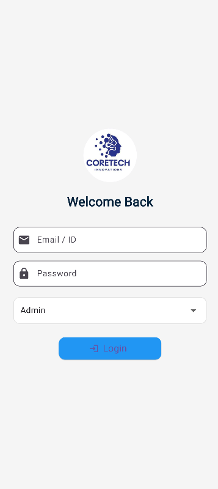
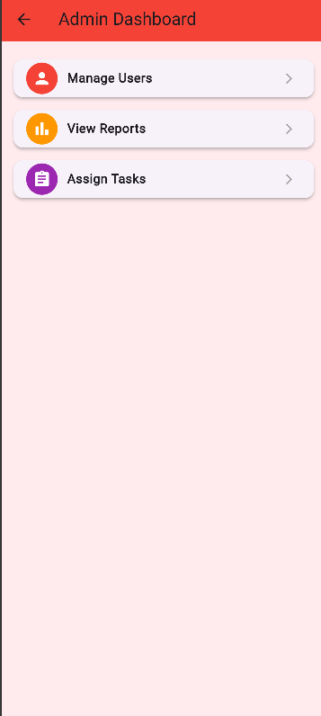
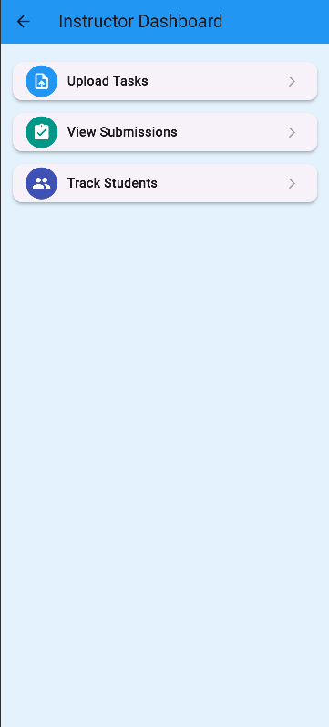
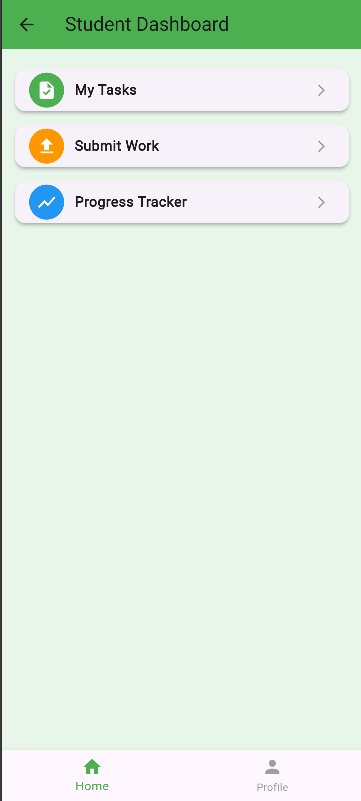
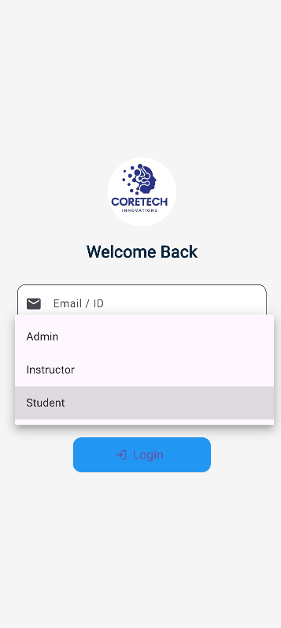

# 🎯 **Role-Based Dashboard App (Flutter)**

A simple and clean **Flutter mobile app** that demonstrates **role-based UI navigation**.  
This app includes a **Login Screen** and **Dashboards** for three different user roles —  
👨‍💼 **Admin**, 👩‍🏫 **Instructor**, and 🎓 **Student**, each with its own unique color theme and options.

---

## 🚀 **Features**

✅ **Static Login Screen**
- 📧 Email and Password input fields  
- 🔐 Login button with navigation  
- 🖼️ Profile image support  

✅ **Role-Based Dashboards**
- 🔴 **Admin Dashboard (Red Theme):** Manage Users, View Reports, Assign Tasks  
- 🔵 **Instructor Dashboard (Blue Theme):** Upload Tasks, View Submissions, Track Students  
- 🟢 **Student Dashboard (Green Theme):** My Tasks, Submit Work, Progress Tracker  

✅ **Navigation**
- 🧭 After pressing **“Login”**, navigates to the respective dashboard (based on selected role).  
- 🧩 Clean routing and widget structure for scalability.  

✅ **UI**
- 💎 Fully responsive Flutter UI  
- 🖊️ Modern icons for each dashboard option  
- 🎨 Custom colors and smooth styling for each role

  ---

## 📸 Screenshots  

  
  
  
  
  

---
👨‍💻 
Zubair Ahmed
📍 CoreTech Software House Internship Project

